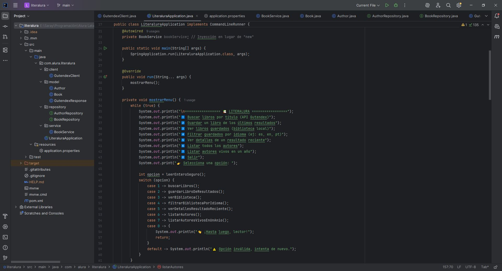
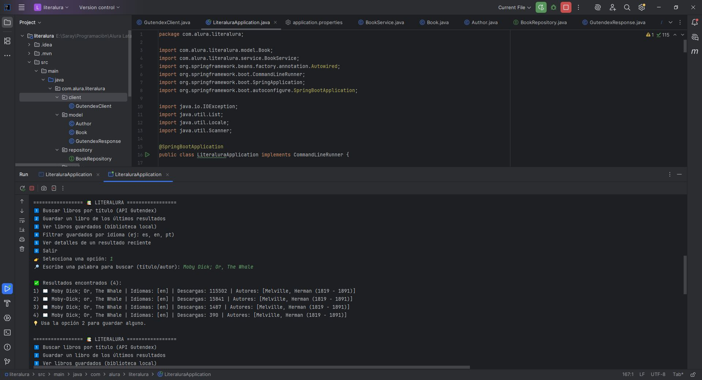
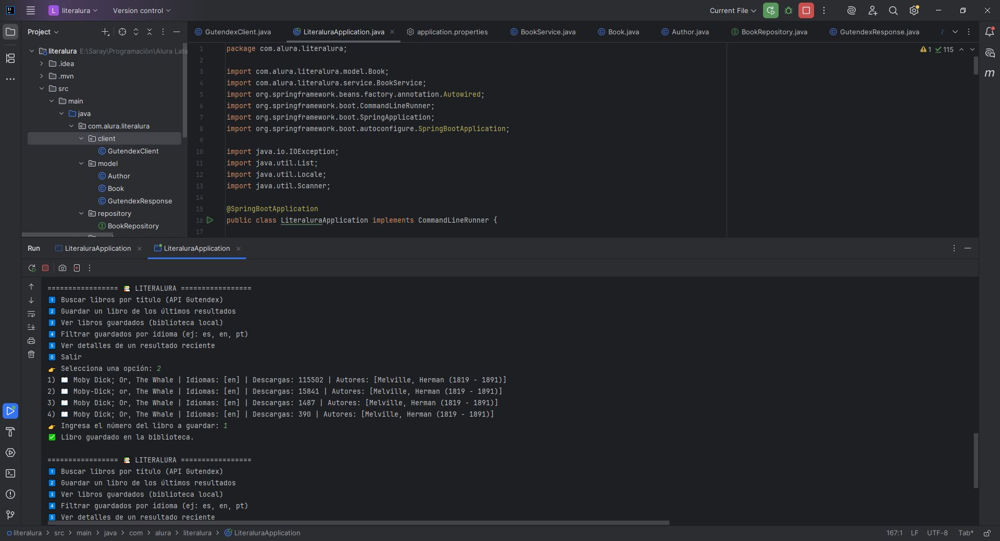
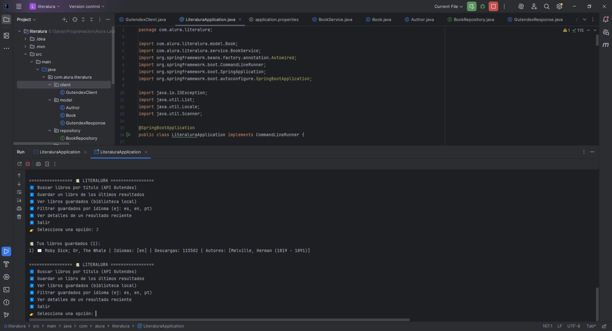
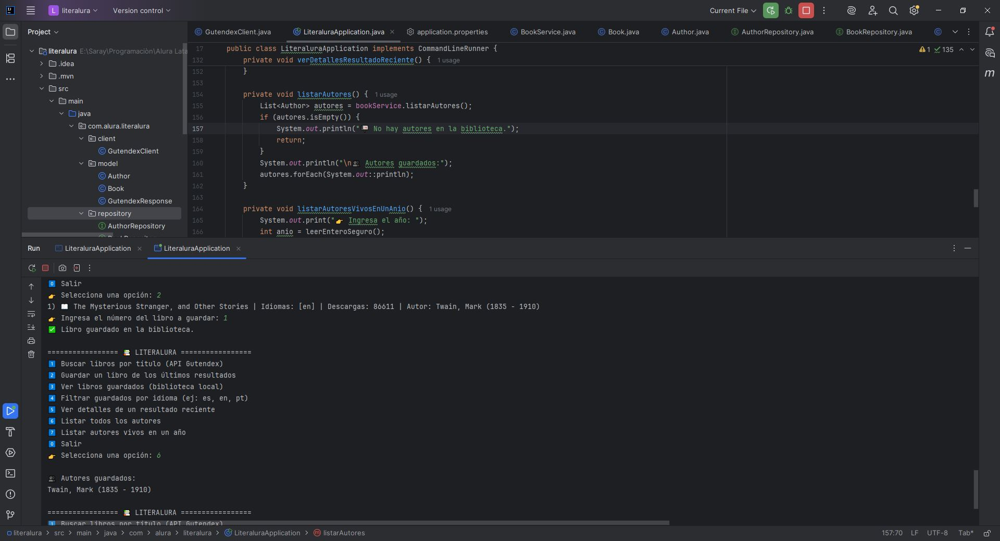
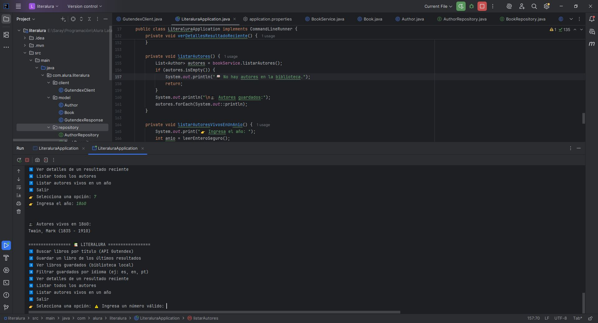
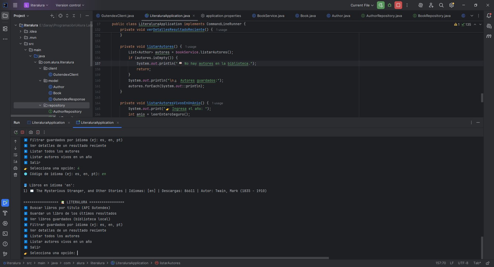
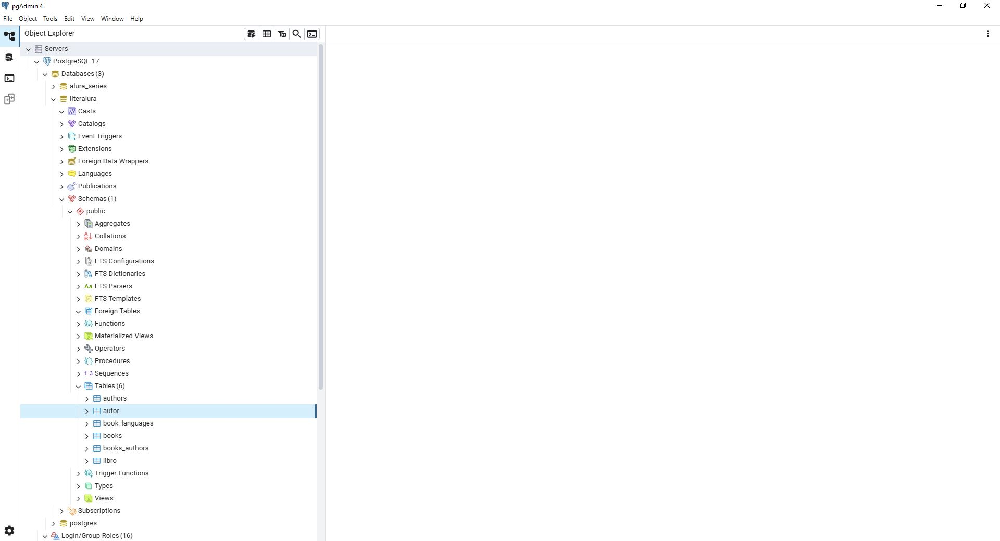

# 📚 Challenge Literalura

   

**Practicando Spring Boot**: Aplicación de consola desarrollada en **Java** que permite buscar libros usando la **API Gutendex**, guardar libros en una **base de datos PostgreSQL** y explorar información de autores y libros mediante un menú interactivo.

---

## 🔹 Funcionalidades

La aplicación ofrece un menú con las siguientes opciones:

1️⃣ **Buscar libros por título** (API Gutendex)  
2️⃣ **Guardar un libro de los últimos resultados**  
3️⃣ **Ver libros guardados** (biblioteca local)  
4️⃣ **Filtrar guardados por idioma** (ej: es, en, pt)  
5️⃣ **Ver detalles de un resultado reciente**  
6️⃣ **Listar todos los autores**  
7️⃣ **Listar autores vivos en un año**  
0️⃣ **Salir**

---

## 🔹 Tecnologías y requisitos

- **Java JDK:** 17 o superior  
  [Download Java LTS](https://www.oracle.com/java/technologies/javase/jdk17-archive-downloads.html)  

- **Maven:** 4 o superior  

- **Spring Boot:** 3.2.3  
  [Spring Initializr](https://start.spring.io/)  

- **PostgreSQL:** 16 o superior  
  [PostgreSQL Downloads](https://www.postgresql.org/download/)  

- **IDE recomendado:** IntelliJ IDEA (opcional)  
  [Descargar IntelliJ IDEA](https://www.jetbrains.com/idea/download/)

---

## 🔹 Configuración inicial en Spring Initializr

- Lenguaje: **Java (17+)**  
- Proyecto: **Maven**  
- Spring Boot: **3.2.3**  
- Tipo de empaquetado: **JAR**  

**Dependencias necesarias:**

- Spring Data JPA  
- PostgreSQL Driver  

---

## 🔹 Uso del proyecto

1. Configura tu base de datos PostgreSQL y ajusta las propiedades de conexión en `application.properties` o `application.yml`.  
2. Ejecuta la aplicación desde IntelliJ o con:
## 🔹 Capturas de pantalla

